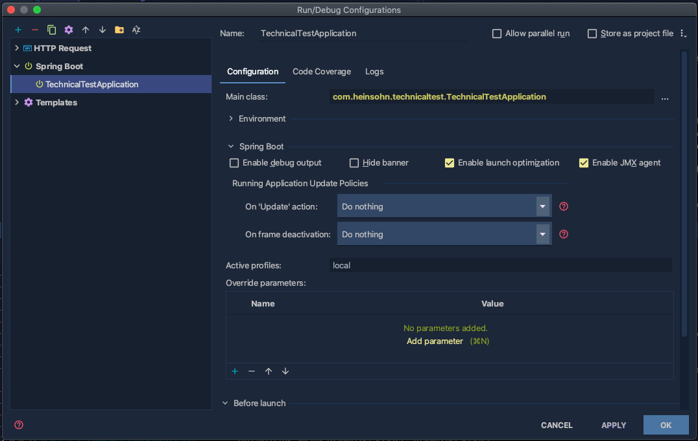
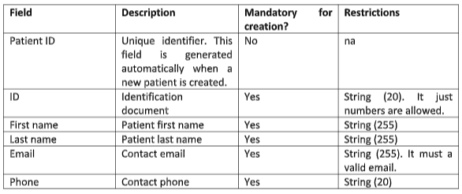
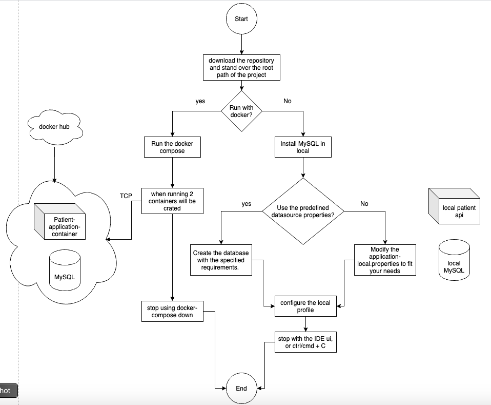

## **Patients Rest API**
This API is performs the operations of creation of patients, and retrieval of patients. Serves as a patient management api.

###### Running the API
In order to run the API with docker-compose: 
1. stand over the root path of the API e.g. `/your_user/../patient-rest-api`.
2. run the command `docker-compose up`.

If the API docker image(`davidgalvis1995/patients-api-image:3.0`) is not in your local environment, docker will pull it down from the docker hub (https://hub.docker.com/repository/docker/davidgalvis1995/patients-api-image/general), the details of how this image was build can be found in the `Dockerfile` of the project. On the other hand, the MySQL image is the official image at its 8th version. After running the compose you will be able  to see the containers running when executing `docker ps`.

3. If you want to stop the application then run `docker-compose down`.

The API actually holds 3 endpoints which you can visualize in:
`src/main/java/com/heinsohn/technicaltest/controllers/PatientController.java`

You can also **run the application locally**, while to perform that action correctly is needed to follow the next steps:
1. Install MySQL in your local machine.
2. Create a database with the `root` user, password = `password`, and the database name of `patients_db`, if you desire, you can also modify the `application-local.properties` to accommodate those environment variables to your needs.
3. Configure the local profile in the run configurations of the project through your preferred IDE, e.g. using Intellij idea it should look like this:

4. Run the project by clicking on the play button.

Please check whether the service is up, by reaching the following endpoint:
`http://localhost:8080/actuator/health`.

###### Requirements to send the a POST request to create a patient:
The post request is: `http://localhost:8080/api/create`

The other endpoints (GET, GET) should be pretty straightforward, but you want to view the API documentation for the 3 endpoints and try with some examples, please run the application and go to the following **swagger** url:
`http://localhost:8080/swagger-ui/#/patient-controller`.

###### Deploying/Running Flowchart
The following flowchart compiles the above mentioned steps. While it is not continuous deployment, it is some kind of deployment in `docker` to be tested in local machines.

Thanks! :)
